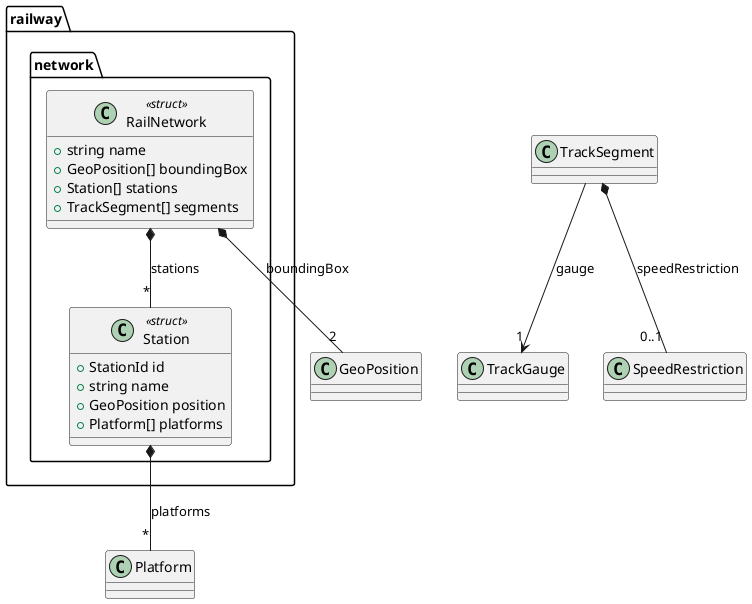
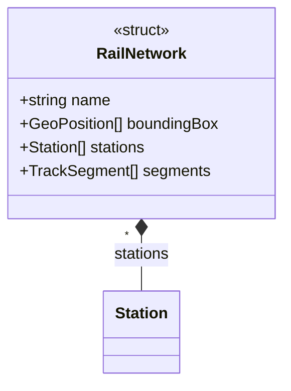

# zserio-diagrams

A [zserio](https://github.com/ndsev/zserio) extension that generates **PlantUML** and **Mermaid** class diagrams and **XMI** files (importable into Sparx Enterprise Architect) directly from zserio schemas.

Point it at any `.zs` file and it turns the type definitions — structs, choices, unions, enums, bitmasks, subtypes, constants — into UML class diagrams with composition, association and inheritance relationships, including field cardinalities.

## Prerequisites

- **Java 21+** (JDK)
- **Apache Ant**

## Building

```bash
# Build a bundled zserio.jar with the diagram extension included (recommended)
ant zserio_bundle.install
```

This downloads zserio 2.18.0 automatically and creates `distr/zserio.jar`. Other targets:

```bash
ant jar      # build only the extension JAR
ant install  # install extension JAR to distr/
ant clean    # clean build artifacts
```

## Quick Start

The repository ships with a small example schema (`zs/railway.zs`, a fictional railway database). Generate diagrams for it:

```bash
java -jar distr/zserio.jar -src zs railway.zs -diagram -diagram-output ./output
```

This writes `schema.puml` (PlantUML) and `schema.mmd` (Mermaid) to `./output`.

## CLI Options

| Option | Description |
|--------|-------------|
| `-diagram` | Enable diagram generation (required) |
| `-diagram-format <format>` | Output format: `plantuml`, `mermaid`, `xmi`, `both`, or `all` (default: `both`) |
| `-diagram-output <dir>` | Output directory for generated diagram files |
| `-diagram-package <pkg>` | Filter by package name (comma-separated for multiple) |
| `-diagram-split-packages` | Generate a separate diagram file for each package |
| `-diagram-include-subtypes` | Include subtypes in diagrams (excluded by default) |
| `-diagram-include-constants` | Include constants in diagrams (excluded by default) |
| `-diagram-layout <engine>` | Layout engine: `default`, `smetana`, or `elk` |
| `-diagram-direction <dir>` | Direction: `top-to-bottom` or `left-to-right` |
| `-diagram-ortho` | Use orthogonal (right-angle) lines in PlantUML diagrams |
| `-diagram-xmi-diagrams <roots>` | Comma-separated root type names (or wildcard patterns) for EA diagram definitions in XMI |
| `-diagram-xmi-depth <N>` | Traversal depth for diagram types (default: `0` = unlimited, full tree) |

### Examples

```bash
# PlantUML only, with smetana layout
java -jar distr/zserio.jar -src zs railway.zs \
    -diagram -diagram-format plantuml -diagram-layout smetana -diagram-output ./output

# Filter to specific packages
java -jar distr/zserio.jar -src zs railway.zs \
    -diagram -diagram-package railway.network,railway.common -diagram-output ./output

# Separate diagram per package, left-to-right, with ortho lines
java -jar distr/zserio.jar -src zs railway.zs \
    -diagram -diagram-split-packages -diagram-direction left-to-right -diagram-ortho \
    -diagram-output ./output

# Include subtypes and constants
java -jar distr/zserio.jar -src zs railway.zs \
    -diagram -diagram-include-subtypes -diagram-include-constants -diagram-output ./output

# XMI for Sparx Enterprise Architect import
java -jar distr/zserio.jar -src zs railway.zs \
    -diagram -diagram-format xmi -diagram-output ./output

# XMI with embedded EA class diagrams for selected root types (wildcards supported)
java -jar distr/zserio.jar -src zs railway.zs \
    -diagram -diagram-format xmi -diagram-output ./output \
    -diagram-xmi-diagrams "Train,RailNetwork,*State"

# All formats (PlantUML + Mermaid + XMI)
java -jar distr/zserio.jar -src zs railway.zs \
    -diagram -diagram-format all -diagram-output ./output
```

## Output Format

### Visual Conventions

| Zserio Type | Stereotype | Relationship Arrow |
|-------------|------------|-------------------|
| struct | `<<struct>>` | Composition `*--` |
| choice | `<<choice>>` | Composition `*--` |
| union | `<<union>>` | Composition `*--` |
| enum | `<<enum>>` | Association `-->` |
| bitmask | `<<bitmask>>` | Association `-->` |
| subtype | `<<subtype>>` | Inheritance `<\|--` |
| const | `<<const>>` | - |

### Cardinality Notation

| Symbol | Meaning |
|--------|---------|
| `1` | Required field |
| `0..1` | Optional field |
| `*` | Array (dynamic size) |
| `N` | Fixed-size array of N elements |

### Sample PlantUML Output

Generated from the bundled railway example schema:



### Sample Mermaid Output



## XMI Export for Sparx Enterprise Architect

The `xmi` format produces XMI 2.1 files that import cleanly into Sparx Enterprise Architect, including EA-specific niceties: element notes from schema doc comments, styled connectors, and — via `-diagram-xmi-diagrams` — ready-made class diagrams.

### EA Diagram Roots

The `-diagram-xmi-diagrams` option embeds EA-compatible diagram definitions in the XMI output. Each root type gets its own class diagram containing the root and all types reachable from it via relationships.

Wildcard patterns are supported and matched against both simple and fully-qualified type names:

- `*Layer` — all types ending with "Layer"
- `Road*` — all types starting with "Road"
- `*Road*` — all types containing "Road"
- `?oadLayer` — single character wildcard

You can mix exact names and wildcards: `Train, *State, railway.network.*`

The `-diagram-xmi-depth` option limits traversal depth from each root type. By default (`0`), the entire reachable tree is included; `1` means direct children only, and so on.

### A Note on the Exporter Header

EA only processes the `<xmi:Extension>` section of an XMI file (element notes, connector styling, diagram definitions) when the file declares

```xml
<xmi:Documentation exporter="Enterprise Architect" exporterVersion="6.5" exporterID="1710"/>
```

The generator therefore emits this header for format compatibility — without it, EA imports the bare UML model but silently drops all diagrams and metadata. The files are of course not produced by Enterprise Architect; this header exists purely so that EA's importer accepts the extension content.

### Validating XMI Output

A structural validator is included that checks generated XMI against what EA expects (well-formedness, required namespaces, ID uniqueness and referential integrity, association structure, …):

```bash
python3 validate_xmi.py output/*.xmi
```

## The Example Schema

`zs/railway.zs` models a small fictional railway database and deliberately exercises every construct the diagrams can visualize:

- **structs** with required, `optional`, dynamic-array, and fixed-array fields
- a **choice** with an enum selector (`SignalState(SignalType type) on type`)
- a **union** (`CarBody`)
- **enums** and **bitmasks**
- **subtypes** (`StationId`, `TrackId`, `TrainId`) and a **const** (`MAX_PLATFORMS`)
- a **parameterized type** (`TrainComposition(uint8 carCount)`) and bit fields (`bit:5`)

It doubles as a regression fixture: if the extension builds and renders this schema, all diagram features work.

## Viewing Generated Diagrams

### PlantUML

- Online: paste content at [plantuml.com](https://www.plantuml.com/plantuml/uml/)
- VS Code: install the "PlantUML" extension
- CLI: `java -jar plantuml.jar schema.puml`

### Mermaid

- Online: paste content at [mermaid.live](https://mermaid.live/)
- GitHub: Mermaid diagrams render natively in markdown files

## How It Works

The extension plugs into zserio's standard extension mechanism (registered via `metainf/services/zserio.tools.Extension`):

1. `DiagramExtension` registers the CLI options and coordinates the workflow
2. `DiagramEmitter` walks the zserio AST and collects types, fields and relationships into a `DiagramModel`
3. `PlantUmlGenerator`, `MermaidGenerator` and `XmiGenerator` render the model into the respective output format
4. `XmiDiagramWriter` adds the EA-specific extension section (element metadata, connectors, diagram definitions with layout)

## License

BSD 3-Clause — see [LICENSE](LICENSE).

Copyright (c) 2026, Klebert Engineering GmbH
